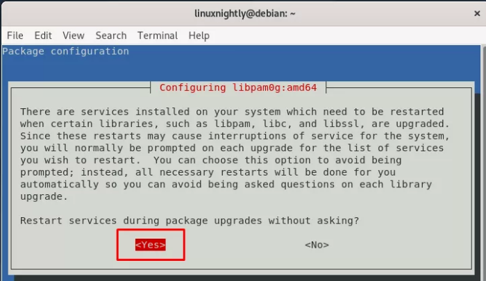

#wsl-debian9-to-debian11<!-- omit in toc -->

A guide for upgrading from Debian 9 to Debian 11 via WSL.

- [Upgrade](#upgrade)
- [Verify](#verify)
- [Credit](#credit)

# Upgrade

Ensure your system is up to date:
```bash
sudo apt update
sudo apt full-upgrade
```

Remove unused dependencies:
```bash
sudo apt autoremove
```

Make sure you're at the home directory:
```bash
cd $HOME
```

Update `/etc/apt/sources.list` to look something like this:
```bash
deb http://deb.debian.org/debian/ bullseye main
deb-src http://deb.debian.org/debian/ bullseye main

deb https://security.debian.org/debian-security bullseye-security main
deb-src http://security.debian.org/debian-security bullseye-security main

deb http://deb.debian.org/debian/ bullseye-updates main
deb-src http://deb.debian.org/debian/ bullseye-updates main
```

Tip for editing the protected file:
```bash
sudo nano /etc/apt/sources.list
```

Save file in nano: `ctrl+x`.

Verify the file is updated:
```bash
cat /etc/apt/sources.list
```

Start the upgrade:
```bash
sudo apt update
sudo apt upgrade
```



Once the partial upgrade completes, do the full upgrade:
```bash
sudo apt full-upgrade
```

# Verify

Check to see what version of Linux you're running
```bash
cat /etc/os-release
```


# Credit
* https://linuxnightly.com/how-to-upgrade-debian/